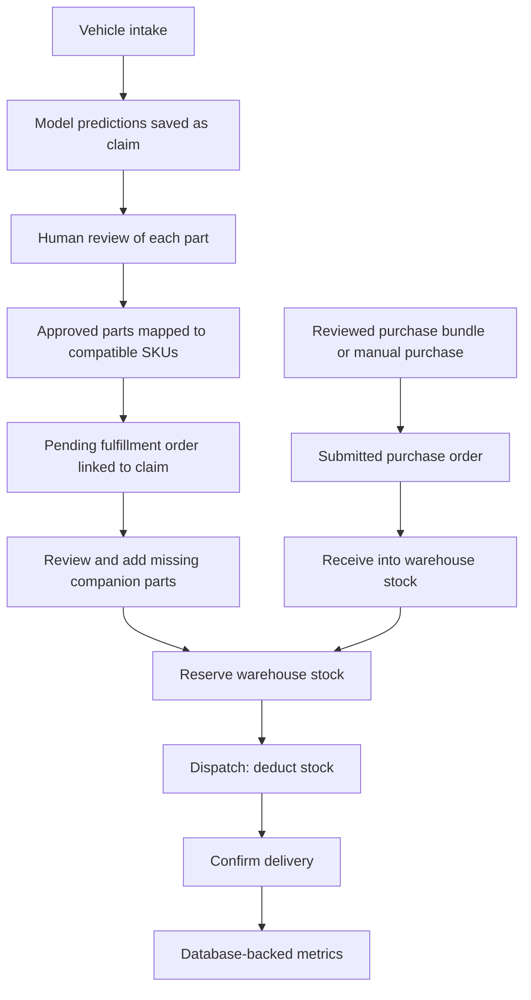

# ML integration: explanation of the seven implementation steps

This document explains the integration implemented in the existing Toyota Parts Management application. It describes what changed, why each step was needed, how users operate the workflow, and what remains outside the implementation.

The [integration plan](ML_INTEGRATION_PLAN_FOR_EXISTING_APP.md) contains the original proposal and chronological progress notes. This guide describes the combined result of Steps 1–7; earlier progress notes in the plan may describe work that was still pending at that time.

## 1. Overall architecture

The application has three main layers:

| Layer | Responsibility | Main files |
| --- | --- | --- |
| React frontend | Intake, review, catalog selection, purchase drafts, fulfillment and dashboards | [src/App.tsx](src/App.tsx) and supporting components |
| FastAPI backend | Model inference, validation, transactions, inventory operations and metrics | [api/main.py](api/main.py), [api/catalog.py](api/catalog.py), [api/logistics.py](api/logistics.py), [api/metrics.py](api/metrics.py) |
| SQLite database | Claims, decisions, catalog identities, orders, stock, reservations and movement history | [api/schema.sql](api/schema.sql), [api/database.py](api/database.py) |

Two different ML outputs support the workflow:

- **Damage prediction model:** suggests individual parts from the vehicle variant, manufacture year and impact zone. Each selected part has its own model score and selection threshold.
- **Association rules:** suggest companion parts commonly associated with another part. These use confidence and lift and do not replace the damage prediction model.

Human review controls which recommendations become operational orders. A prediction score is not an inventory quantity, a verified damage diagnosis, or a delivery priority.



## 2. Step 1 — Establish the model and rule contract

### Why this was needed

The frontend and backend must use the same feature meanings and output ordering as the saved model. A model can load successfully while still receiving incompatible input or having its output scores assigned to the wrong parts.

### What changed

[api/ml_contract.py](api/ml_contract.py) validates that part classes, thresholds and classifier outputs align. It reads the fitted model vocabulary instead of maintaining a separate guessed list of vehicle variants.

The existing artifact uses the following serving policy:

- Vehicle age is calculated using reference year **2026**, clipped to **0–45**.
- The month feature remains **June**, matching the documented legacy input policy.
- Unknown backend vehicle labels use the fitted `OTHER_MODEL` category when available.
- Positive-class probabilities are extracted using classifier class labels, including estimators trained with only one class.

[api/inspect_ml_release.py](api/inspect_ml_release.py) inspects the release. [api/ml_release_manifest.json](api/ml_release_manifest.json) records hashes, vocabulary, thresholds and inspected runtime information.

### Result and limits

Inference has a defined, tested input/output contract. This step did **not** retrain the model or establish new accuracy figures. The original dataset and training run are unavailable, and the manifest does not reconstruct them. Changing the fixed year/month feature policy requires a deliberate model-release decision.

## 3. Step 2 — Persist intake and human review reliably

### Why this was needed

Predictions must survive a page refresh, retain their model provenance and support partial review. A network retry must not accidentally create another claim.

### What changed

The API stores the claim, impact zone, selected part predictions, per-part thresholds and model version. Claims with no selected parts are also retained so they can be inspected manually.

Intake supports an `Idempotency-Key` header:

- Same key and same request: return the original saved result.
- Same key and different request: reject with HTTP 409.
- No key: each successful submission creates a new intake.

Review supports a whole claim or selected parts. A claim stays pending while parts remain unreviewed. Once review finishes, at least one approved part makes the claim approved; otherwise it is rejected. Individual decisions preserve the distinction in mixed reviews.

Review batches run in a transaction. If one requested claim or part is invalid, the batch does not partially update other records.

### Main endpoints

| Endpoint | Purpose |
| --- | --- |
| `POST /api/predict-intake` | Run inference and save intake atomically. |
| `GET /api/claims` | List pending claims by default. |
| `GET /api/claims?status=ALL` | Read claim history and part decisions. |
| `POST /api/claims/review` | Approve or reject claims or individual parts. |
| `GET /api/ready` | Check database, model and rules without creating a claim. |

Review timestamps are stored. Authenticated reviewer identity and an immutable history of every review change are not implemented.

## 4. Step 3 — Connect the prediction screen to the real API

### Why this was needed

Broad labels such as `AQUA` do not necessarily match fitted variants such as `AQUA NHP10`. The UI also needed to distinguish model scores, impact zones, empty results and request failures.

### What changed

The Prediction Queue loads supported variants and year bounds from `GET /api/model-metadata`. It displays the saved impact zone and individual part scores and uses real queue counts and filters.

[src/prediction.ts](src/prediction.ts) defines frontend contracts and intake-recovery helpers. Before sending intake, the frontend saves the request and retry key in account-scoped session storage. If the response is lost, the user can retry the original submission without creating another claim. If this storage cannot be written, submission stops before the request is sent.

Loading, API errors, an empty queue, no filter matches and zero predicted parts have separate UI states. Review actions reload server data to show the persisted result.

### How to use it

1. Open Prediction Queue.
2. Select a supported vehicle variant, manufacture year and impact zone.
3. Submit the intake and inspect each suggested part.
4. Approve or reject the parts after inspection.
5. Use claim conversion after completing review.

Approval itself does not create an order or reserve stock. The UI does not offer `OTHER_MODEL` as a real vehicle identity; an unlisted variant requires manual assessment.

## 5. Step 4 — Turn reviewed bundles into purchase drafts

### Why this was needed

Companion recommendations needed to become editable purchase lines rather than temporary suggestions. The application also needed to preserve commercial details and explain where bundle lines came from.

### What changed

[src/ReorderBundleModal.tsx](src/ReorderBundleModal.tsx) allows users to select recommended lines and review quantities before adding them to shared purchase-draft state. [src/purchase.ts](src/purchase.ts) contains the draft and bundle logic.

Suggested companion quantity uses:

```text
suggested quantity = ceil(primary quantity × rule confidence)
```

For example, 3 primary units with confidence 0.61 suggest 2 companion units. This is an advisory rule, not confirmed demand. Users review quantities before ordering.

Online recommendations and the local rule fallback follow the same rounding and ordering policy. Missing prices remain missing instead of silently becoming zero. Saving requires valid commercial details; shipping and source metadata are persisted with the purchase.

### Draft versus saved order

The shared draft survives navigation between views while the application remains loaded. Server-saved orders survive a browser reload. Unsaved React draft state should not be treated as durable storage.

Creating a purchase order does not increase warehouse stock. Stock increases through the receipt operation added in Step 6.

## 6. Step 5 — Add catalog identity and claim-to-order traceability

### Why this was needed

A label such as `FRONT BUMPER` does not uniquely identify a purchasable part. Different vehicle variants may require different SKUs, and the same SKU can have several explicitly recorded fitments.

### What changed

The catalog records SKU, canonical part label, display name, optional aliases and exact vehicle/model-year fitments. The backend validates these relationships independently of the UI.

Existing name-only stock is preserved as legacy unmapped stock. It is kept separate from catalog inventory so the system does not invent compatibility.

Purchase lines reference catalog identity. Distinct SKUs, suppliers or fitments remain separate instead of being merged by name. Bundle-derived purchase lines require verified catalog fitment before saving.

[src/CatalogManager.tsx](src/CatalogManager.tsx) provides catalog and SKU stock entry. [src/ClaimConversionModal.tsx](src/ClaimConversionModal.tsx) converts a completed approved claim into fulfillment.

### Claim conversion rules

`POST /api/claims/{accident_id}/fulfillment-draft` requires:

1. A completed review with at least one approved part.
2. An existing destination workshop.
3. Exactly one line for every accepted prediction.
4. Compatible SKU, positive integer quantity and explicit unit price for each line.

The order, prediction links and unique conversion record commit together. Repeating equivalent conversion details returns the same order; changing details after conversion returns HTTP 409.

Converted claims cannot have their review changed, and linked orders cannot be deleted through the normal deletion action. One complete fulfillment order per claim is supported; splitting a claim across workshops is not implemented.

## 7. Step 6 — Persist companions and control inventory movements

### Why this was needed

Order statuses must correspond to real inventory operations. Multiple orders must not promise the same stock, and dispatch retries must not deduct stock twice.

### Fulfillment lifecycle

| Action | Order status | On-hand stock | Reserved stock |
| --- | --- | --- | --- |
| Create order | PENDING | Unchanged | Unchanged |
| Reserve all lines | PENDING | Unchanged | Increases |
| Release reservation | PENDING | Unchanged | Decreases |
| Dispatch | IN TRANSIT | Decreases | Released for dispatched lines |
| Confirm delivery | FULFILLED | Unchanged | Unchanged |

```text
available stock = catalog on-hand stock − active reservations
```

For example, 10 units on hand with 3 reserved means 7 available. Dispatching those 3 leaves 7 on hand, zero reserved and 7 available. Confirming delivery leaves those balances unchanged.

[api/logistics.py](api/logistics.py) performs stock operations transactionally. Insufficient stock rolls back the entire operation. Repeated dispatch or delivery status requests do not deduct stock again. Backward transitions are blocked.

### Companion additions

In **Inventory & Fulfillment → Manage stock & companions**, users can map legacy lines to compatible SKUs and review missing companion recommendations. Adding a companion creates a real fulfillment line with its rule version and source-line details.

Existing companions are omitted from suggestions. Users choose compatible SKUs, quantities and prices. Reservations must be released before changing lines.

### Receipts, adjustments and history

The **Purchase receipts, adjustments & movement history** panel supports:

- Receiving an entire submitted catalog-backed purchase into one warehouse.
- Recording signed inventory adjustments with a reason.
- Inspecting recent stock and reservation movement events.

Receipt retries do not receive the same purchase twice. Adjustment retries with the same request identity do not apply the delta twice. Negative adjustments cannot consume reserved stock.

The ledger records new SKU stock entries, reservations, releases, dispatches, receipts and adjustments. Historical balances are preserved without fabricating past movement events.

### Scope

Reservation and receipt operate on complete orders at a single warehouse. Partial shipments, partial receipts, returns and cancellation restocking are not implemented. Legacy purchase lines without catalog identities cannot be received into SKU inventory.

## 8. Step 7 — Replace simulated dashboard figures

### Why this was needed

Fixed totals and demonstration charts looked like real operational measurements. The old predicted-demand column actually displayed reorder levels, which are not model forecasts.

### What changed

[api/metrics.py](api/metrics.py) provides `GET /api/metrics` using a consistent database snapshot. [src/OperationalMetrics.tsx](src/OperationalMetrics.tsx) displays these values with their scope and refresh time.

| Metric | Meaning |
| --- | --- |
| Pending claims | Claims awaiting review, including zero-prediction claims. |
| Unreviewed part predictions | Saved prediction occurrences without a review decision. |
| Approved part predictions | Saved prediction occurrences accepted by a reviewer. |
| Catalog on hand | Total catalog inventory across warehouses. |
| Reserved units | Total active warehouse reservations. |
| Available SKU units | Catalog on hand minus reserved units. |
| Legacy units | Name-only stock awaiting catalog mapping, reported separately. |
| Delivery rate | Delivered orders divided by all fulfillment orders. |
| Workshop counts | Pending, in-transit and delivered orders for each workshop. |

These metrics cover **all warehouses, all time** and are independent of table filters. With no orders, delivery rate is unavailable rather than a fabricated percentage.

Cards refresh every 15 seconds, on window focus and through **Refresh metrics**. API failure displays unavailable values. The stock table now shows warehouse, on-hand, reserved and available quantities.

Simulated performance charts, fixed stock distribution, fake pagination, invented stock dates and seeded operational notifications were removed. This step does not introduce a time-series demand forecasting model or a measured inventory-accuracy metric.

## 9. Database changes at a glance

| Records | Purpose |
| --- | --- |
| `claims`, `claim_predictions` | Saved intake, scores, thresholds, model version and review decisions. |
| `intake_requests` | Recover the original result of an intake retry. |
| `catalog_items`, `catalog_fitments`, `part_aliases` | SKU identity and explicitly validated compatibility. |
| `inventory`, `catalog_inventory` | Separate legacy stock and catalog stock balances. |
| `purchase_orders`, `purchase_order_lines` | Saved commercial details and purchase provenance. |
| `fulfillment_orders`, `fulfillment_order_lines` | Workshop requirements, catalog references and source prediction/companion links. |
| `claim_conversions` | One traceable fulfillment conversion per claim. |
| `stock_reservations` | Warehouse units allocated to fulfillment lines. |
| `inventory_movements` | Recorded stock and reservation changes. |
| `logistics_requests` | Retry protection for supported logistics operations. |

Backend startup initializes the schema and applies migrations. The purchase-line migration preserves existing IDs and data while removing the old name-only uniqueness rule. Do not delete the database to apply these changes.

## 10. Run and verify the workflow

The installed Python 3.13 environment was used successfully for validation. The existing Python 3.14 virtual environment could not install the pinned scikit-learn release without a compiler.

Start the backend from the project root when it is not already running:

```powershell
py -3.13 -m uvicorn api.main:app --host 127.0.0.1 --port 8000 --reload
```

The workspace Vite server is already managed by the development environment. Its `/api` proxy targets the backend; do not start a duplicate frontend server.

### Manual acceptance sequence

1. Create a workshop in Inventory & Fulfillment.
2. Submit vehicle intake and inspect the saved part predictions.
3. Complete part review, rejecting any incorrect suggestions.
4. Create compatible catalog SKUs for accepted parts and any companions needed.
5. Create and submit a purchase with those SKUs, then receive it into a warehouse; alternatively, enter existing SKU stock through catalog setup.
6. Convert the reviewed claim into a fulfillment order for the workshop.
7. Open Manage stock & companions and add any reviewed missing companions.
8. Reserve all order lines at the warehouse. If stock is insufficient, resolve the shortage and retry.
9. Dispatch the order, then confirm delivery when delivered.
10. Reload the app and check the claim link, saved lines, balances, movement history and metrics.

### Automated checks

```powershell
py -3.13 -m unittest api.test_claims_api api.test_ml_contract
py -3.13 -m api.smoke_test
node --test src/prediction.test.cjs src/purchase.test.cjs
.\node_modules\.bin\tsc.cmd --noEmit
npm run build
```

At completion of Step 7, **22 backend/model tests, 7 frontend logic tests, the persistence smoke test, TypeScript checking and the production build passed**.

API lifecycle tests use isolated databases and deterministic mocked inference. Separate model-contract tests exercise the saved artifact. The complete workflow test covers intake, mixed review, purchase receipt, conversion, reservation, dispatch, delivery and persistence after database reinitialization. Companion additions, rollback and retry safety have targeted coverage.

Browser interaction and visual acceptance have not been performed. Passing these checks does not establish new model accuracy or production readiness.

## 11. Remaining work beyond the seven steps

- Perform the manual browser acceptance sequence and visual checks.
- Replace demo/local authentication with backend authentication and enforce API permissions before operational deployment.
- Add authenticated reviewer identity and immutable review-event history if required.
- Retrain and evaluate a reproducible model release when the source dataset and training environment are available.
- Implement partial receipts/shipments, returns, cancellation restocking or multi-workshop claim splitting if business requirements call for them.
- Configure production API routing, persistent database storage and deployment access controls.

The seven steps connect the existing model and association rules to a persisted, reviewable operational workflow. They do not replace human inspection or the separate work needed to validate and deploy the application for production use.
