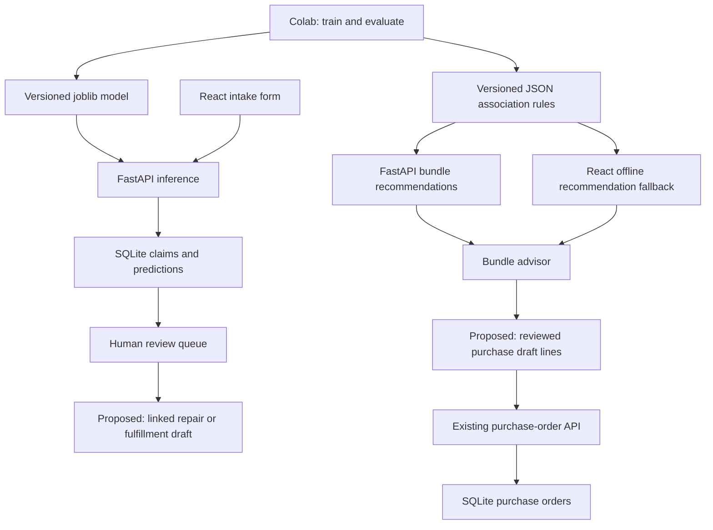

# ML integration plan for the existing Toyota Parts Management app

For an explanation of the completed Steps 1–7, architecture, database changes, user workflow and validation, read [ML integration implementation explained](ML_INTEGRATION_IMPLEMENTATION_EXPLAINED.md). The progress notes below are chronological; statements about pending work reflect the stage at which each note was written.

This guide explains how to finish integrating the two ML outputs into the application already in this folder. It is based on a source-code review, not a new model evaluation or a runtime test. The implementation steps below are proposed changes unless explicitly marked as existing.

### Implementation progress — Step 1

The existing model has now been inspected and inference-tested using the installed Python 3.13 environment with scikit-learn 1.6.1. Five targeted contract tests and the existing persistence smoke test passed.

- `api/ml_contract.py` validates class/threshold/output alignment, clips age to the documented 0–45 range, preserves the legacy 2026/June feature policy, and extracts probabilities by class label, including single-class estimators.
- Unknown vehicle labels now use the fitted `OTHER_MODEL` category. This is an explicit serving policy for the legacy artifact; its original rare-model mapping was not exported. Broad UI labels such as `AQUA` are not equivalent to the fitted variant `AQUA NHP10`; variant selection remains a UI integration task.
- `api/ml_release_manifest.json` records artifact hashes, fitted vocabulary, thresholds, rule count, and the inspected runtime versions. It does not claim to recover the original training environment or validate historical accuracy.
- `api/inspect_ml_release.py` regenerates the inventory without modifying the model or database.

Run the checks with `py -3.13 -m unittest api.test_ml_contract -v` and `py -3.13 -m api.smoke_test`. Inspect artifacts with `py -3.13 -m api.inspect_ml_release`.

The existing `.venv` uses Python 3.14 and lacks scikit-learn. Installing the pinned release there attempted a source build and failed because no compiler was available. The installed Python 3.13 environment successfully loaded and tested the model. Use `py -3.13 -m uvicorn api.main:app --host 127.0.0.1 --port 8000 --reload` for this verified environment, or create a dedicated Python 3.13 environment before installing the requirements.

Retraining, corrected cross-validation, and a new reproducible training export remain pending: the original Excel dataset and training run are not present in this repository. The existing binary has not been retrained or overwritten.

### Implementation progress — Step 2

Implemented typed intake, claim-list, and review contracts in `api/main.py`, with additive startup migrations in `api/database.py` and corresponding fresh-database fields in `api/schema.sql`.

- New predictions persist the loaded model's SHA-256 version and each selected part's threshold. Legacy rows retain null metadata rather than fabricated versions.
- `GET /api/claims` returns impact zone and metadata, including pending claims with no predictions. Its default still lists pending work; `?status=ALL`, `APPROVED`, or `REJECTED` provides history with individual review decisions.
- Whole-claim review updates every prediction. Partial reviews keep the claim pending until all parts are reviewed. A completed mixed review has claim status `APPROVED` if any part was accepted; the part-level decisions show exactly what was accepted or rejected. All-rejected claims become `REJECTED`. Whole-claim review can explicitly replace earlier decisions; this is not an immutable audit log yet.
- Review batches are transactional and reject missing claims/parts without partially applying the batch. Decision timestamps are stored; authenticated reviewer identity and a full event history remain future work.
- `POST /api/predict-intake` supports the optional `Idempotency-Key` header. Reusing a key and normalized request returns the saved original response; reusing it with different inputs returns HTTP 409. The claim, predictions, and replay record commit together. Requests without a key retain the existing create-on-each-call behavior; frontend key management belongs to Step 3.
- `GET /api/ready` reports database/model/rule availability and versions with HTTP 200 or 503, without creating a claim. Rule version is the hash of canonicalized loaded JSON, while the artifact manifest records the raw file hash.

Validation: five HTTP lifecycle tests in `api/test_claims_api.py` cover replay/conflict handling, metadata, partial/mixed/whole review, zero-prediction claims, invalid inputs, rollback, repeatable startup, and readiness. The existing persistence smoke test also passes. The HTTP tests isolate storage in temporary databases and mock inference; actual model inference was covered in Step 1.

Order-conversion idempotency will be implemented together with the conversion endpoint in Step 5; that endpoint does not exist yet.

### Implementation progress — Step 3

Updated `PredictionQueueView` in `src/App.tsx` and added explicit frontend contracts in `src/prediction.ts`.

- `/api/model-metadata` exposes the loaded model's fitted vehicle variants, supported intake zones, year limits, and model version. The selector uses those variants rather than broad names such as `AQUA`. `OTHER_MODEL` is not presented as a vehicle identity; unlisted variants require manual assessment.
- Queue records preserve per-part scores, thresholds, impact zone, and model version. Part badges display numeric model scores, and rows show the actual impact zone or “Not recorded.”
- Average-score filtering excludes claims without scores. Year options come from saved claims, including older vehicles. High/Medium/Low score labels use the same 80/50 boundaries as the filter, independently of the legacy API urgency label.
- Added loading, API failure/retry, empty queue, no filter matches, and zero-prediction/manual-inspection messages. Intake validation uses the API metadata's year bounds.
- Intake requests send `Idempotency-Key`. Pending request details and the key are stored in account-scoped session storage and restored after navigation or reload. Unknown outcomes retain the original details for retry; explicit validation failures allow correction. If session storage cannot save the pending request, submission is stopped before sending.
- Reviews reload authoritative queue data instead of modifying a mock-derived local row structure. Selections are reconciled after refresh, and repeated submissions are guarded while work is running.
- “Approve All Claims” accurately describes the current action; it does not claim to create a repair order. Mock queue statistics and pagination were replaced with actual pending-claim, suggestion, manual-inspection, and selection counts.

Validation passed: TypeScript (`tsc --noEmit`), production build, six API lifecycle/metadata tests, and three frontend logic tests (`node --test src/prediction.test.cjs`). Browser interaction and visual checks were not performed.

### Implementation progress — Step 4

The bundle advisor now creates real purchase-draft lines through `ReorderBundleModal.onAddBundle` → `DemandForecastView` → the draft state in `App` → `PurchaseOrdersView` → `/api/orders`.

- Extracted the advisor into `src/ReorderBundleModal.tsx` and draft contracts/validation into `src/purchase.ts`. Primary options come from rule antecedents. All matching companions are shown with explicit selection and editable positive integer quantities; companions start unselected. The primary part can be included or excluded.
- API and fallback use ceiling-based suggested quantities, identical confidence rounding, and deterministic ordering. Both identify the rule release using SHA-256 of UTF-8 rule text with normalized line endings. The modal visibly identifies offline recommendations and displays the release fingerprint.
- Added lines have stable IDs, blank supplier/vehicle fields, and a missing price represented by `null`. The draft provides editable supplier, vehicle compatibility, quantity, and price fields. Scores are not converted into a purchasing urgency label.
- `App` owns draft rows and shipping. Edits and deletions survive view navigation. Saving removes only the successfully saved line IDs, preserving any additional lines added while that request was in progress. Search filters do not change the full-order totals or which lines are submitted.
- Save as draft and Finalize validate all commercial fields first. Both require completed supplier, compatibility, and price information; an incomplete working draft remains editable in memory. Zero is accepted only when explicitly entered as a price. Unsaved drafts are not restored after a page reload; saved orders are loaded from SQLite.
- Added `source_json` on purchase lines and `shipping_cost` on purchase orders, with additive startup migrations. Saved bundle provenance includes primary part, rule fingerprint, and online/offline mode and is returned/displayed with saved lines.
- Removed silent merging of same-name parts. Until Step 5 introduces catalog identity, duplicate normalized part names are rejected on both client and server, even if supplier or fitment differs. Use separate orders for different variants in this interim schema.
- Saves are guarded while pending. An uncertain save outcome retains the working draft and asks the user to check saved orders; purchase-order request idempotency is not implemented in this step.

Validation passed: TypeScript, production build, eight API tests, six frontend logic tests, the persistence smoke test, and a cross-language comparison of 66 API/fallback bundles including the rule fingerprint. Browser interaction and visual checks were not performed.

### Implementation progress — Step 5

Implemented explicit catalog identity and reviewed-claim conversion in `api/catalog.py`, with UI components `src/CatalogManager.tsx` and `src/ClaimConversionModal.tsx`.

**Catalog and inventory:**

- `GET/POST /api/catalog` lists or registers orderable SKUs, canonical part labels, descriptions, aliases, and exact model/year fitments. Repeating the same SKU/details adds fitments without duplicating the item; conflicting SKU details or aliases return a conflict.
- Catalog data is entered from a verified parts source. No fitment, price, or SKU mapping is inferred from the ML score. No real catalog entries are seeded by this change.
- `catalog_inventory` stores quantities by warehouse and catalog item. `/api/stock` accepts an optional `sku`; when supplied, the backend validates the part label and exact fitment before changing stock. Existing name-only inventory stays intact and is returned as `LEGACY_UNMAPPED` with no invented fitment.
- Demand Forecast and Purchase Orders contain a “Part catalog and SKU stock” panel. Demand stock filters consider every recorded fitment. The original stock-entry action is labelled “Add Legacy Stock” to distinguish it from cataloged inventory.

**Purchase identity:**

- Draft lines can select a SKU and one of its recorded fitments. Bundle-derived lines require this selection before saving; existing manual name-only lines remain supported for compatibility.
- Purchase lines now reference `catalog_item_id`. The migration rebuilds the old purchase-line table to remove name-only uniqueness while preserving existing row IDs and values. Different SKUs, suppliers, or fitments are retained as separate rows rather than merged. Identical repeated catalog lines are rejected; legacy repeated names remain rejected.
- Source details and shipping from Step 4 remain persisted. The backend validates SKU-to-label and SKU-to-fitment associations independently of the UI.
- At startup, the SQLite association-rule snapshot is replaced from the selected authoritative JSON release instead of retaining outdated `INSERT OR IGNORE` values. The API-local file still takes precedence when present.

**Reviewed claim to fulfillment:**

- The Prediction Queue now offers “Create fulfillment from reviewed claim.” Select an approved claim, destination workshop, compatible SKU, positive integer quantity, and explicit unit price for each accepted part. A workshop must already exist.
- `POST /api/claims/{accident_id}/fulfillment-draft` requires a completed review with at least one accepted prediction and exactly one line for every accepted part. It validates all fitments before creating a pending fulfillment order.
- Order creation, linked prediction lines, and the unique claim-conversion record commit in one transaction. Repeating equivalent details, even with reordered lines, returns the existing fulfillment ID. Different details for an already-converted claim return HTTP 409.
- Fulfillment responses/UI retain source claim, SKU, vehicle model, and year. Claim history includes `fulfillment_order_id`; converted claims are marked in the conversion selector. Review changes and deletion of linked fulfillment orders are blocked to preserve traceability.
- The current conversion is one complete fulfillment order per claim. Splitting one claim across workshops, revising a converted order, authenticated reviewer identity, and immutable review-event history are not implemented.

Validation passed: 11 API tests, seven frontend logic tests, persistence smoke test, TypeScript, and production build. Coverage includes incompatible fitments, separate stock/order identities, atomic failed conversion, replay/conflict handling, linked-order protection, and repeatable legacy migration with preserved row data and valid foreign keys. Browser interaction and visual checks were not performed.

Inventory reservations, dispatch/receipt movements, and persisted companion additions belong to Step 6 and remain pending. A pending fulfillment order does not reserve or deduct stock yet. Dashboard metric completion follows in Step 7. Startup applies schema migrations; use the verified Python 3.13 backend environment.

## 1. Documents reviewed

The four main documents describe training, integration, UI changes, and the project's background:

| Document | How it informs this plan |
| --- | --- |
| [Colab complete fine-tuning guide](COLAB_COMPLETE_FINE_TUNING_GUIDE.md) | Training code, preprocessing, model export, threshold selection, and association-rule generation. |
| [How to integrate outputs](HOW_TO_INTEGRATE_OUTPUTS_TO_EXISTING_SYSTEM.md) | React/FastAPI integration and intended artifact locations. |
| [UI modifications and new additions](UI_MODIFICATIONS_AND_NEW_ADDITIONS.md) | Intended changes to the four dashboard views. |
| [What we did here from scratch](WHAT_WE_DID_HERE_FROM_SCRATCH.md) | Business goals and previously reported results. |

The alternative [generic integration guide](HOW_TO_INTEGRATE_OUTPUTS_TO_EXISTING_SYSTEM%20%281%29.md) was also reviewed. Its `/api/ai/...` routes and PostgreSQL-style example tables do not match this app. Use the existing routes and SQLite tables described below.

## 2. What the ML outputs do

**Vehicle intake prediction — Option A:** `api/real_model_option_a_tuned.joblib` contains a trained pipeline, part classes, and per-part decision thresholds. FastAPI receives a vehicle model, make year, and impact zone and returns suggested damaged parts with model scores. A person reviews these suggestions.

**Companion recommendations — Option B:** `src/real_warehouse_synergy_rules.json` contains associations between parts found together in historical repair baskets. Given a primary part and an order quantity, the app recommends companion parts and quantities.

These outputs do not, by themselves, forecast next month's unit demand, identify compatible Toyota part numbers, determine supplier prices, or allocate warehouse stock. Those functions need operational data and business rules. Keep the labels and workflows clear about this distinction.

## 3. Current implementation: reuse what exists

The current package uses React 19, TypeScript, Vite, and Tailwind CSS v4. Some older documents refer to React 18 and entirely mocked screens; that description is no longer accurate.

| Area | Existing implementation | Remaining integration work |
| --- | --- | --- |
| Python inference | `get_model_data()` in `api/main.py` lazily loads and caches the model. | Validate artifact metadata and align preprocessing with training. |
| Intake screen | `PredictionQueueView` sends `POST /api/predict-intake`. | Preserve and display impact zone and individual scores; improve supported model/year options. |
| Prediction persistence | Intake saves `vehicles`, `claims`, and `claim_predictions`. `GET /api/claims` restores pending suggestions. | Include zero-prediction claims appropriately and support review/history consistently. |
| Human review | `POST /api/claims/review` updates claim status or individual prediction actions. | Connect approval to an actual repair/fulfillment workflow, with duplicate prevention. |
| Bundle advisor | `ReorderBundleModal` calls `/api/reorder-bundle`, with imported JSON as fallback. | Replace the add-to-order alert with a real draft update; match fallback calculations. |
| Purchase orders | `/api/orders` saves and lists drafts/submitted orders. | Accept reviewed bundle lines and preserve their source. |
| Inventory | `/api/stock` saves and lists stock by warehouse and part. | Preserve vehicle compatibility and distinguish reorder levels from forecasts. |
| Fulfillment | Workshop and fulfillment CRUD is connected to SQLite. | Add persisted companion suggestions and inventory reservations/dispatch handling. |
| Dashboard totals | Several cards, charts, and pagination labels remain hardcoded. | Calculate them from persisted data with explicit definitions. |

The active dashboard is implemented in [src/App.tsx](src/App.tsx). The large components under `src/imports/` are Figma exports; they are not the views rendered by `App`. Make workflow changes in the active components.

## 4. Architecture to retain



Training stays in Colab. The running application performs inference using an exported model; it does not retrain on each request. Keep the Python model in the backend and use React for inputs, review, and rendering.

## 5. Phase 1 — Make the exported artifacts reproducible

Before replacing the current model, adjust the Colab workflow and export a model release with its preprocessing contract.

### Training and serving inputs must match

| Feature | Colab code | Current API | Required change |
| --- | --- | --- | --- |
| `Model_Grouped` | Rare models become `OTHER_MODEL`. | Uppercases the input directly. | Export the grouping vocabulary and apply the same mapping at inference; define handling for unseen models. |
| `Damage_Zone` | Uses the column only if it has multiple values. | Always supplies Front, Rear, or Side. | Record whether the model actually uses the feature and its supported categories. |
| `Make_Year` | Converts to integer, fills missing values. | Uses request value. | Define one validation policy across UI and API. |
| `Vehicle_Age` | Clips `2026 - Make_Year` to 0–45. | Uses unclipped `2026 - make_year`. | Apply the same clipping and reference-year policy. |
| `month_num` | Uses historical month, defaulting to June. | Always uses June. | Expose an intake date and retrain/validate with a matching date policy, or explicitly retain the existing fixed-month contract for this model version. |

Do not silently switch the deployed model to a new age or date calculation. First define the feature meaning, then train and serve with the same definition. If repair dates are available, age at the time of the accident is a useful candidate for a future retrained version.

Extend the exported artifact with metadata such as:

```text
model_version, trained_at, dataset_version
python_version, sklearn_version, pandas_version, numpy_version, joblib_version
cat_cols, num_cols, supported_damage_zones
model_grouping_map, unknown_model_policy
age_reference_policy, age_clip, month_policy
evaluation_metrics
```

Retain `pipeline`, `classes`, and `thresholds`, which the existing API consumes. Validate that class count, threshold count, and classifier output count agree. Extract positive-class probabilities using each estimator's class labels, including the single-class case, rather than assuming column 1 always represents the desired class.

### Correct the evaluation process before making performance claims

The source documents report micro F1 `0.4629` and Hamming loss `0.1368`. Their “86.3% accuracy” is approximately `1 - Hamming loss`: correctness across individual binary part decisions. It is not proof that 86.3% of claims have their complete part list predicted correctly, and it is not a calibrated probability for each suggestion.

The notebook currently fits preprocessing before cross-validation, tunes thresholds and reports results on the same out-of-fold predictions, and exports a forest with different hyperparameters from the forest used for threshold tuning. It also always exports a Random Forest rather than selecting the winning architecture programmatically.

For the next model release:

1. Reserve an untouched evaluation set; use vehicle/claim grouping or a time split if the data requires it.
2. Fit preprocessing inside each training fold.
3. Select the model and tune thresholds without using the final evaluation set.
4. Keep the final estimator configuration consistent with the evaluated configuration.
5. Check how damage zones were collected. If inferred from replaced parts, evaluate using zones independently available at intake to avoid overstating real-world performance.
6. Report per-part precision/recall, micro and macro F1, Hamming loss, and complete-list accuracy separately. Handle rare classes that have only one label in a fold.

The association rules are mined from baskets containing at least two parts. Their confidence describes that selected historical population, not all claims. A rule's confidence is an association frequency, and its lift is relative association strength; neither establishes vehicle compatibility or the required quantity per repair.

## 6. Phase 2 — Stabilize the existing API contract

Keep these route names to avoid breaking the connected frontend:

| Route | Current purpose |
| --- | --- |
| `POST /api/predict-intake` | Predict and persist a new claim. This is a write operation, not a preview-only endpoint. |
| `GET /api/claims` | Return pending claims with unreviewed predicted parts. |
| `POST /api/claims/review` | Approve/reject whole claims or selected parts. |
| `GET /api/reorder-bundle?primary_part=FRONT%20BUMPER&quantity=20` | Return companion recommendations. |
| `GET/POST /api/orders` | List/save purchase orders. |
| `GET/POST /api/stock` | List/add warehouse inventory. |
| `GET/POST /api/workshops` | List/create workshops. |
| `GET/POST /api/fulfillment` | List/create fulfillment orders. |
| `PATCH/DELETE /api/fulfillment/{order_id}` | Change status or delete an order. |

Existing intake request:

```json
{
  "model": "AQUA",
  "make_year": 2013,
  "damage_zone": "Front"
}
```

The response contains `accident_id`, `vehicle`, `damage_zone`, and `predicted_parts`. Each prediction contains `part_name`, `confidence_pct`, and `urgency`. Extend it with `model_version` and optionally the applied threshold so saved predictions can be traced to the model that produced them.

Existing bundle response fields are `primary_part`, `quantity`, and `companions`. Companion entries use `companionPart`, `lift`, `suggestedOrderQty`, and `confidencePct`. Do not copy the alternative guide's `bundle_suggestions` response or `order_qty` parameter without updating both sides.

Make these backend changes:

- Validate nonblank models and parts, integer positive quantities, and supported zones before invoking the model. Align the UI's 1980–2026 year range with the API's wider range through a documented business policy.
- Return `damage_zone` from `GET /api/claims`; it is already selected in SQL but omitted from the response.
- Represent no-prediction claims explicitly. The current inner joins hide them from the queue even though the claim was saved.
- Add typed request/response models for reviews and claims instead of accepting arbitrary part dictionaries.
- Make whole-claim and per-part reviews consistent. Whole-claim review currently leaves individual `human_action` values unchanged; reviewing all parts individually leaves the claim status pending. Define and implement aggregation rules, including mixed decisions.
- Add request idempotency for intake and order conversion so retries cannot create duplicate claims or orders.
- Add a readiness endpoint that reports database availability, model availability/version, and rule version. It should not create claims as a health check.

## 7. Phase 3 — Finish `PredictionQueueView`

The intake form and API call already exist. Extend them rather than adding a second intake flow to the New Order button.

1. Define explicit claim and prediction types instead of using the shape of `predRows` as the operational contract.
2. Preserve `confidence_pct` for every part in both the initial prediction response and the saved-claim mapping. Current mappings discard it after calculating an average.
3. Preserve and display the actual impact zone. Do not default a missing zone to “Front Impact,” because that would invent claim data.
4. Render part badges with the score, for example `FRONT BUMPER — 74.1% model score`; example scores are illustrative, not expected outputs.
5. Rename the current “Demand” display to describe prediction confidence. Its High/Medium/Low labels currently derive from probability, not warehouse demand or repair urgency.
6. Build year filters from the available claims. The current hardcoded 2023–2025 options exclude the default 2013 intake.
7. Populate the model selector from a maintained vehicle catalog or model metadata, with a defined unsupported-model message.
8. Show separate loading, no-results, no-predictions, and API-failure states. An unavailable model must not produce a successful saved-claim message.

### Connect approval to a real next step

`approveAllToRepairOrder()` currently changes review status and clears the queue. It does not create a repair order.

Implement a backend conversion operation, for example a **new** `POST /api/claims/{accident_id}/fulfillment-draft` route. It should accept the destination workshop and explicitly reviewed part quantities, record the review, create the linked draft, and return its ID in one transaction. This route is proposed and does not exist yet.

Reuse fulfillment orders if they represent workshop repair requests in this project. If a repair order is a different business object, add dedicated repair-order tables first. Do not automatically treat an approved prediction as a supplier purchase order: procurement should account for stock and confirmed quantities.

Add a unique conversion reference so double-clicking or retrying returns the existing result rather than creating another order. Keep approval-only actions labelled as approvals until conversion is implemented.

## 8. Phase 4 — Connect the bundle advisor to purchase orders

The current modal displays recommendations, but its final button only calls `alert()`. Complete the flow through the purchase draft owned by `App`.

Proposed component flow:

```text
ReorderBundleModal.onAddBundle(reviewedLines)
  -> DemandForecastView.onAddBundle(reviewedLines)
  -> App updates the purchase draft and navigates to 'purchase'
  -> PurchaseOrdersView collects/validates supplier, compatibility and price
  -> Existing POST /api/orders persists the draft or submitted order
```

Use a dedicated draft-line type that supports incomplete commercial details. `NewOrderDetail` currently requires supplier, vehicle, part, quantity, and price. ML only supplies a part label and suggested quantity, so it cannot populate that entire type truthfully.

The modal should:

- Include the primary part and its quantity, plus only the companions selected by the user.
- Let the user edit quantities and inspect all recommendations rather than silently adding unseen rows beyond the displayed first four.
- Label quantities as suggestions and require positive integers.
- Derive available primary parts from rule antecedents or the parts catalog.
- Show a useful empty state when no rule matches.
- Indicate when recommendations come from the local fallback and include the rule version.
- Use the same calculation online and offline. The API currently uses Python `round`, while the frontend uses `Math.ceil`. A proposed simple policy is `max(1, ceil(quantity * confidence))` on both sides; adopt it explicitly and test parity.

Keep draft state authoritative in `App` or a dedicated shared store. Currently deleting a row in `PurchaseOrdersView` changes only its local copy; the parent still holds the row, so navigation or new additions can restore it.

Persist an explicit draft when the user chooses Save as draft. Only show success after the backend succeeds. Track source claim/rule version in saved lines, and avoid inventing supplier prices or interpreting part confidence as purchasing urgency.

## 9. Phase 5 — Resolve part identity and inventory links

The current `parts` table uniquely identifies a part by its name. Inventory is unique by warehouse and part. Entering stock records a vehicle separately, but does not connect that vehicle to the inventory row. This cannot distinguish two incompatible bumpers sharing the same description.

Before using recommendations to reserve or purchase stock, introduce a mapping from ML labels to real catalog items:

```text
ML label: FRONT BUMPER
    -> compatible catalog part/SKU selected using model and year
    -> warehouse stock and supplier pricing for that SKU
```

Suggested schema extensions, implemented as migrations:

| Data | Proposed change |
| --- | --- |
| Part catalog | Separate generic ML labels from orderable SKUs; add alias and vehicle-fitment mappings. |
| Prediction audit | Store model version, applied threshold, review time, and reviewer identity. |
| Workflow links | Link claim/prediction IDs to fulfillment or repair lines; make conversion references unique. |
| Purchase lines | Preserve source and compatibility; revise the current unique `(purchase_order_id, part_id)` key if separate supplier/vehicle lines are allowed. |
| Inventory movements | Track reservations, dispatch, receipt, and adjustments with unique operation references. |
| Rule releases | Track rule version and replace/update an entire active release consistently. |

The current order upsert merges matching part names even when supplier or vehicle differs. Fix this identity policy before automatically merging bundle lines.

`synergy_rules` is seeded in SQLite with `INSERT OR IGNORE`, but the recommendation API reads JSON. Updated JSON can therefore disagree with old database rows. Keep one authoritative rule release and synchronize the database if it remains in use. Also note that `api/database.py` prefers an API-local rules file over the frontend file if both exist.

## 10. Phase 6 — Finish fulfillment and dashboard integration

### Missing companion notices

For each fulfillment draft, resolve its lines to canonical ML labels, find matching rules, and suggest companions not already present. Deduplicate suggestions that appear through several antecedents and define a quantity policy rather than summing them blindly.

Use the actual matched rule's confidence and lift. The older UI guide's hardcoded bumper/fog-lamp “7.2x” example is not a substitute for looking up that pair.

The existing fulfillment PATCH endpoint only updates status. Adding a companion to a saved order needs a **new** line-edit endpoint that validates SKU, quantity, price, and order state and persists the change. Refresh the order after success.

Preserve `vehicle_model` and `make_year` end to end: the frontend currently submits an empty vehicle model, and the list response drops both fields. Fulfillment status changes also do not currently decrement or reserve inventory. Implement transactional stock movements with insufficient-stock checks before describing the workflow as stock allocation.

### Demand screen and metrics

`DemandForecastView` currently places `reorder_level` in the displayed predicted-demand field and fills vehicle/year with placeholders. Return real compatibility data and label reorder levels correctly.

A separate future demand feature could aggregate confirmed repair requirements over a defined period and compare them with usable stock and open purchase quantities. Define reservations and outstanding requirements carefully so they are not counted twice. Neither of the two current ML artifacts provides a monthly demand forecast.

Replace hardcoded totals and pagination with calculated values. Define approval rate, pending-review count, stock health, and fulfillment rate before implementing their queries. Only add a damage-zone filter where records actually have that relationship; ordinary inventory rows do not currently have a damage zone.

## 11. Local setup and deployment

Existing artifact locations:

```text
api/real_model_option_a_tuned.joblib
src/real_warehouse_synergy_rules.json
api/main.py
api/database.py
api/schema.sql
api/requirements.txt
```

From the project root, use the existing virtual environment if it is suitable. If one does not exist, create it with `py -m venv .venv`. The following PowerShell commands install the repository requirements and start the backend:

```powershell
.\.venv\Scripts\python.exe -m pip install -r api/requirements.txt
.\.venv\Scripts\python.exe -m uvicorn api.main:app --host 127.0.0.1 --port 8000 --reload
```

These are instructions to execute during implementation; they were not run as part of this document review. Confirm the pinned packages can be installed for the chosen Python version and match the environment that produced the model. The notebook currently installs unpinned libraries, so compatibility is not established merely by having a requirements file.

FastAPI startup initializes `api/toyota_parts.db` using the existing schema. Do not replace the schema with the generic guide's PostgreSQL examples.

The Vite preview is already running in the current workspace; do not start a duplicate server. `vite.config.ts` already proxies `/api` to `API_URL`, defaulting to `http://127.0.0.1:8000`. For an independent checkout without a running frontend, use the project's existing `npm run dev` script after installing dependencies.

For deployment, serve the built frontend and route `/api` to the Python service. The development proxy is not included in the static build. Include the model and authoritative rules in the backend deployment, provide persistent storage for SQLite, and run a production service without `--reload`. If the preview runs on a separate host, its proxy target must be reachable from that host.

Before operational use, replace the current localStorage/demo-password login with backend authentication and enforce authorization on the API. Restrict CORS to the intended deployment when cross-origin access is needed. Only deploy trusted joblib artifacts: loading them executes a Python serialization format.

## 12. Validation checklist

Start with existing checks, then add targeted integration coverage for the new behavior:

```powershell
npm run build
.\node_modules\.bin\tsc.cmd --noEmit
.\.venv\Scripts\python.exe -m api.smoke_test
```

The current smoke test covers basic stock, order, workshop, and fulfillment persistence in a temporary database. It does not validate model inference, HTTP request validation, claim review, or UI behavior.

| Scenario | Required result |
| --- | --- |
| Same fixture in Colab and API | Matching preprocessing, selected classes, thresholds, and scores within numeric tolerance. |
| Unknown model, unsupported zone, invalid year | Defined validation/fallback behavior, with no accidental saved claim. |
| API/model unavailable | Clear failure state; no fabricated prediction or successful-save message. |
| No parts pass thresholds | Claim is saved and remains visible through an appropriate status/history path. |
| Reload after intake | Claim, zone, individual scores, and model version remain available. |
| Whole/partial/mixed review | Consistent claim status, part decisions, and review history. |
| Retry conversion | One linked order, not duplicates. |
| Bundle API versus fallback | Identical ordering and quantities for the same rule version, including fractional boundaries. |
| Add reviewed bundle | Only selected lines appear in the draft, including the primary part when selected. |
| Delete draft row and navigate | The removed row does not return. |
| Save order then reload | Lines, commercial details, and source references remain correct. |
| Same label, different fitment/supplier | Lines remain distinct according to the catalog identity policy. |
| Add fulfillment companion | A real persisted line appears; no alert-only success. |
| Dispatch twice or insufficient stock | No duplicate stock deduction or negative inventory. |
| Dashboard metrics | Values reflect defined database queries, including an empty database. |

## 13. Implementation order and completion criteria

1. Establish a reproducible model/rule release and matching preprocessing.
2. Extend typed API contracts, prediction persistence, and review semantics.
3. Display impact zone and per-part scores in the prediction queue.
4. Connect reviewed bundles to shared purchase-draft state and existing order persistence.
5. Resolve SKU/vehicle compatibility and add traceable claim-to-order conversion.
6. Add persisted fulfillment companion actions and inventory movements. **Implemented; see Step 6 notes below.**
7. Replace misleading/hardcoded dashboard values and validate the full workflow. **Implemented; see Step 7 notes below.**

Integration is complete when a vehicle intake produces a persisted, traceable prediction; a reviewer can turn confirmed requirements into one linked operational order; selected companion recommendations become real purchase or fulfillment lines; and refreshing the app preserves the result. Model scores, business urgency, and stock quantities should remain distinct throughout that flow.

## Step 6 implementation

- Open **Inventory & Fulfillment → Manage stock & companions** to map legacy lines to verified SKUs, review missing companion suggestions, reserve a warehouse, release reservations, dispatch and confirm delivery.
- Companion lines persist their source line, rule version, confidence, lift, fitment, quantity and price. Retrying an addition does not create duplicate lines.
- Reservations reduce available stock. Dispatch deducts on-hand stock once; delivery does not deduct it again. Insufficient-stock transactions roll back completely. Backward transitions and deletion of orders with movement history are blocked.
- **Purchase receipts, adjustments & movement history** receives submitted catalog-backed purchases and records signed stock adjustments with reasons. Receipt and adjustment retries are idempotent; adjustments cannot consume reserved stock.
- The ledger records new SKU entries, reservations, releases, dispatches, receipts and adjustments. Existing stock balances remain intact without fabricated historical events.
- Manual fulfillment creation preserves the entered vehicle model. Bulk delivery confirmation is limited to orders in transit.

This step supports full-order reservation and receipt at a single warehouse. Partial shipments, partial receipts, returns and cancellation restocking remain outside this implementation. Unmapped fulfillment lines require compatible catalog identities before reservation; legacy purchase lines cannot be received into SKU stock.

Validation covers API retry safety, stock competition, rollback, fitment rejection, companion persistence, the persistence smoke test, existing frontend tests, TypeScript and production build. Browser interaction checks remain manual. Step 7 is dashboard metrics and full-workflow validation.

## Step 7 implementation

`GET /api/metrics` reads a consistent database snapshot. Metrics cover **all warehouses, all time**, independent of table filters:

| Metric | Definition |
| --- | --- |
| Pending claims | Claims with PENDING status, including zero-prediction claims. |
| Unreviewed part predictions | Saved prediction rows without a human action; these are occurrences, not forecast units. |
| Approved part predictions | Saved prediction rows approved by reviewers. |
| Catalog on hand | Sum of catalog inventory quantities across warehouses. |
| Reserved / available | Sum of active reservations / catalog on hand minus reserved. |
| Legacy units | Stock without catalog identity, reported separately. |
| Delivery rate | Delivered fulfillment orders divided by all fulfillment orders; no value when there are no orders. |
| Workshop counts | Pending, in-transit and delivered order counts per workshop, including zero-order workshops. |

Dashboard cards refresh every 15 seconds, on window focus and through Refresh metrics. Request failures show unavailable values rather than fabricated zeroes. The stock table now displays warehouse, on-hand, reserved and available quantities. The former predicted-demand column contained reorder levels and has been removed. Simulated performance charts, stock distribution, fixed pagination, invented stock dates and seeded operational notifications have been removed.

Validation includes an empty database, zero-prediction intake and a complete persisted workflow: intake → mixed review → catalog purchase → receipt → claim conversion → reservation → dispatch → delivery → database reinitialization. The API workflow uses deterministic mocked inference; separate model-contract tests exercise the real artifact. Companion persistence and retry safety remain covered by the logistics tests.

Manual browser acceptance: create an intake, review its parts, create compatible SKUs, receive a submitted purchase, convert the approved claim, add any reviewed companions, reserve, dispatch and confirm delivery. Refresh the app and verify the claim link, stock balance, ledger and metrics. Confirm that API downtime shows an error and that an empty database shows zero counts with no delivery rate. Browser acceptance and production authentication/deployment remain separate from the automated implementation checks.
